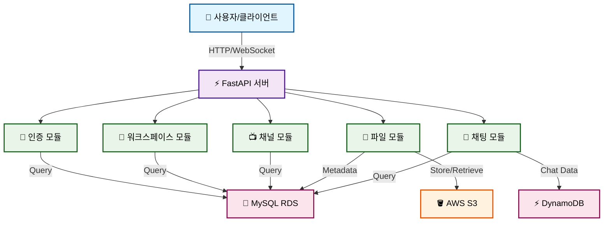
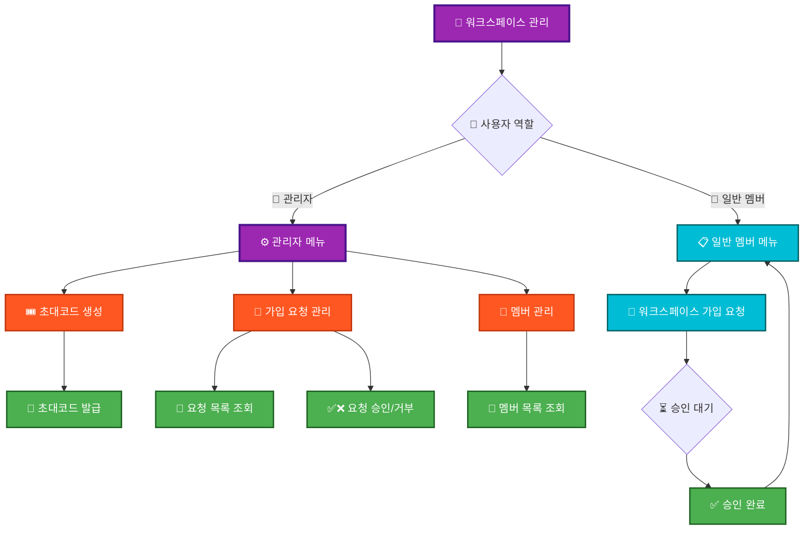
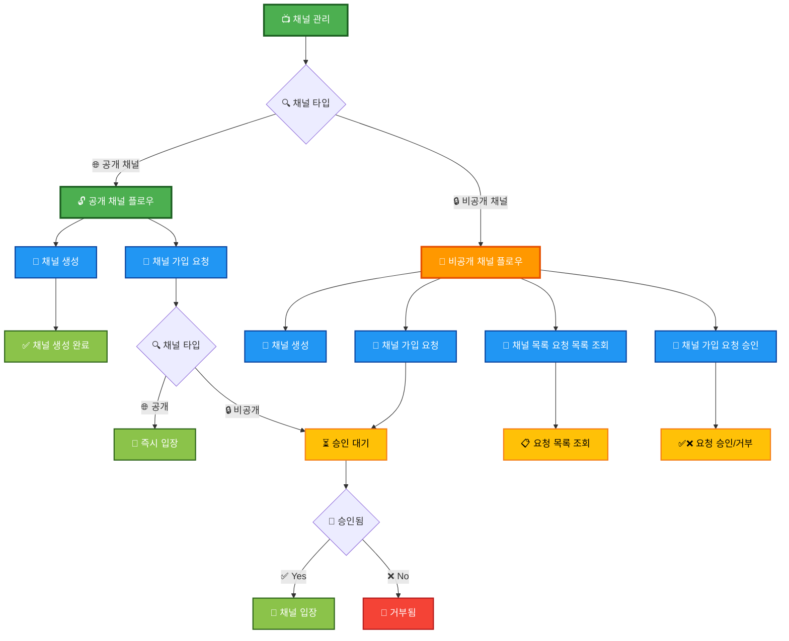
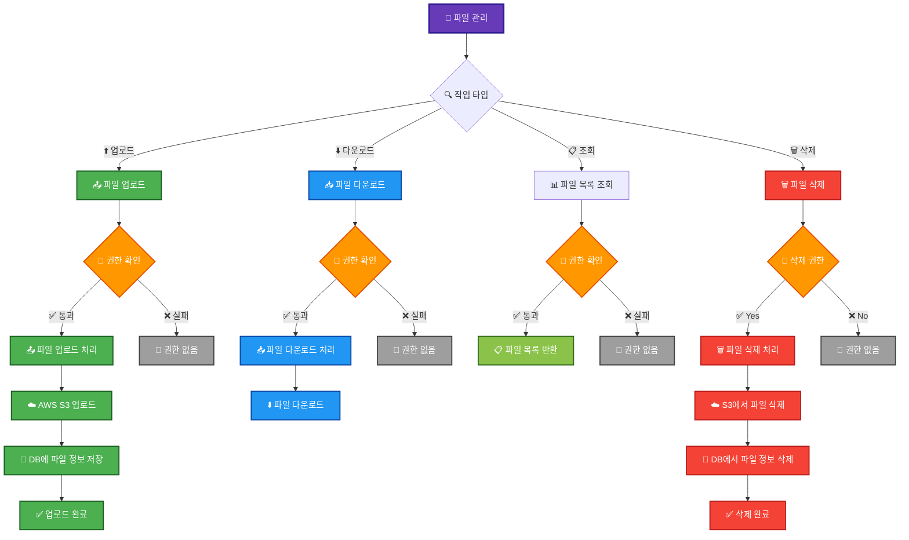
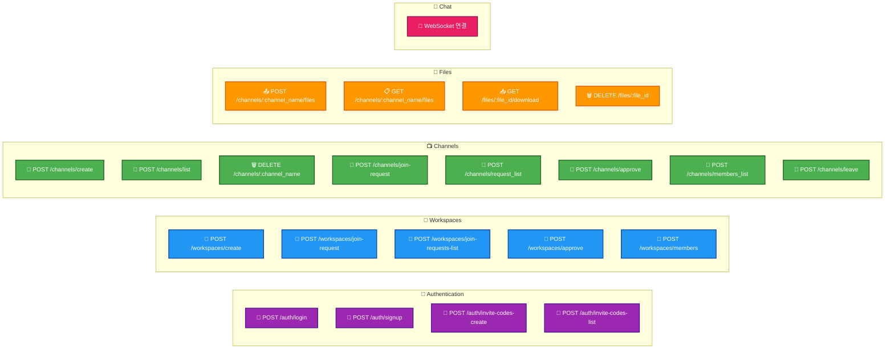

# 🚀 Safe Slack API 플로우차트

## 🏗️ 1. 서비스 모듈 구조

```mermaid
graph TB
    A[👤 사용자/클라이언트]
    
    B["⚡ FastAPI 서버"]
    
    D[🔑 인증 모듈]
    E[🏢 워크스페이스 모듈]
    F[📺 채널 모듈]
    G[📁 파일 모듈]
    H[💬 채팅 모듈]
    
    I[🪣 AWS S3]
    
    K[🐬 MySQL RDS]
    L[⚡ DynamoDB]
    
    A -->|HTTP/WebSocket| B
    B --> D
    B --> E
    B --> F
    B --> G
    B --> H
    D -->|Query| K
    E -->|Query| K
    F -->|Query| K
    G -->|Store/Retrieve| I
    G -->|Metadata| K
    H -->|Query| K
    H -->|Chat Data| L
    
    classDef clientStyle fill:#e1f5fe,stroke:#01579b,stroke-width:2px,color:#000
    classDef apiStyle fill:#f3e5f5,stroke:#4a148c,stroke-width:2px,color:#000
    classDef businessStyle fill:#e8f5e8,stroke:#1b5e20,stroke-width:2px,color:#000
    classDef externalStyle fill:#fff3e0,stroke:#e65100,stroke-width:2px,color:#000
    classDef dbStyle fill:#fce4ec,stroke:#880e4f,stroke-width:2px,color:#000
    
    class A clientStyle
    class B apiStyle
    class D,E,F,G,H businessStyle
    class I externalStyle
    class K,L dbStyle
```

## 🏢 2. 워크스페이스 관리 플로우

```mermaid
flowchart TD
    A[🏢 워크스페이스 관리] --> B{👤 사용자 역할}
    
    B -->|👑 관리자| C[⚙️ 관리자 메뉴]
    B -->|👤 일반 멤버| D[📋 일반 멤버 메뉴]
    
    C --> E[🎟️ 초대코드 생성]
    C --> F[📝 가입 요청 관리]
    C --> G[👥 멤버 관리]
    
    E --> P[🎫 초대코드 발급]
    F --> Q[📄 요청 목록 조회]
    F --> R[✅❌ 요청 승인/거부]
    G --> S[👥 멤버 목록 조회]
    
    D --> L[📨 워크스페이스 가입 요청]
    L --> N{⏳ 승인 대기}
    N --> O[✅ 승인 완료]
    O --> D
    
    classDef adminStyle fill:#9c27b0,stroke:#4a148c,stroke-width:3px,color:white
    classDef memberStyle fill:#00bcd4,stroke:#006064,stroke-width:2px,color:white
    classDef actionStyle fill:#ff5722,stroke:#bf360c,stroke-width:2px,color:white
    classDef resultStyle fill:#4caf50,stroke:#1b5e20,stroke-width:2px,color:white
    
    class A,C adminStyle
    class D,L memberStyle
    class E,F,G actionStyle
    class P,Q,R,S,O resultStyle
```

## 📺 3. 채널 관리 플로우

```mermaid
flowchart TD
    A[📺 채널 관리] --> B{🔍 채널 타입}
    
    B -->|🌐 공개 채널| C[🔓 공개 채널 플로우]
    B -->|🔒 비공개 채널| D[🔐 비공개 채널 플로우]
    
    C --> E[🚀 채널 생성]
    C --> F[🚀 채널 가입 요청]
    
    D --> H[🚀 채널 생성]
    D --> I[🚀 채널 가입 요청]
    D --> J[🚀 채널 목록 요청 목록 조회]
    D --> K[🚀 채널 가입 요청 승인]
    
    E --> L[✅ 채널 생성 완료]
    F --> M{🔍 채널 타입}
    M -->|🌐 공개| N[🚪 즉시 입장]
    M -->|🔒 비공개| O[⏳ 승인 대기]
    
    I --> O
    J --> P[📋 요청 목록 조회]
    K --> Q[✅❌ 요청 승인/거부]
    O --> R{🤔 승인됨}
    R -->|✅ Yes| S[🎉 채널 입장]
    R -->|❌ No| T[🚫 거부됨]
    
    classDef publicStyle fill:#4caf50,stroke:#1b5e20,stroke-width:3px,color:white
    classDef privateStyle fill:#ff9800,stroke:#e65100,stroke-width:3px,color:white
    classDef apiStyle fill:#2196f3,stroke:#0d47a1,stroke-width:2px,color:white
    classDef successStyle fill:#8bc34a,stroke:#33691e,stroke-width:2px,color:white
    classDef waitStyle fill:#ffc107,stroke:#f57f17,stroke-width:2px,color:black
    classDef errorStyle fill:#f44336,stroke:#b71c1c,stroke-width:2px,color:white
    
    class A,C publicStyle
    class D privateStyle
    class E,F,G,H,I,J,K apiStyle
    class L,N,S successStyle
    class O,P,Q waitStyle
    class T errorStyle
```

## 📁 4. 파일 관리 플로우

```mermaid
flowchart TD
    A[📁 파일 관리] --> B{🔍 작업 타입}
    
    B -->|⬆️ 업로드| C[📤 파일 업로드]
    B -->|⬇️ 다운로드| D[📥 파일 다운로드]
    B -->|📋 조회| E[📊 파일 목록 조회]
    B -->|🗑️ 삭제| F[🗑️ 파일 삭제]
    
    C --> H{🔐 권한 확인}
    H -->|✅ 통과| I[📤 파일 업로드 처리]
    H -->|❌ 실패| J[🚫 권한 없음]
    
    I --> K[☁️ AWS S3 업로드]
    K --> L[💾 DB에 파일 정보 저장]
    L --> M[✅ 업로드 완료]
    
    D --> O{🔐 권한 확인}
    O -->|✅ 통과| P[📥 파일 다운로드 처리]
    O -->|❌ 실패| Q[🚫 권한 없음]
    
    P --> S[⬇️ 파일 다운로드]
    
    E --> U{🔐 권한 확인}
    U -->|✅ 통과| V[📋 파일 목록 반환]
    U -->|❌ 실패| W[🚫 권한 없음]
    
    F --> Y{🔐 삭제 권한}
    Y -->|✅ Yes| Z[🗑️ 파일 삭제 처리]
    Y -->|❌ No| AA[🚫 권한 없음]
    
    Z --> BB[☁️ S3에서 파일 삭제]
    BB --> CC[💾 DB에서 파일 정보 삭제]
    CC --> DD[✅ 삭제 완료]
    
    classDef mainStyle fill:#673ab7,stroke:#311b92,stroke-width:3px,color:white
    classDef uploadStyle fill:#4caf50,stroke:#1b5e20,stroke-width:2px,color:white
    classDef downloadStyle fill:#2196f3,stroke:#0d47a1,stroke-width:2px,color:white
    classDef deleteStyle fill:#f44336,stroke:#b71c1c,stroke-width:2px,color:white
    classDef processStyle fill:#ff9800,stroke:#e65100,stroke-width:2px,color:white
    classDef errorStyle fill:#9e9e9e,stroke:#424242,stroke-width:2px,color:white
    classDef successStyle fill:#8bc34a,stroke:#33691e,stroke-width:2px,color:white
    
    class A mainStyle
    class C,I,K,L,M uploadStyle
    class D,P,R,S downloadStyle
    class F,Z,BB,CC,DD deleteStyle
    class H,O,U,Y processStyle
    class J,Q,W,AA errorStyle
    class V successStyle
```

## 🚀 5. API 엔드포인트 구조

```mermaid
graph LR
    subgraph "🔐 Authentication"
        A1[🚀 POST /auth/login]
        A2[🚀 POST /auth/signup]
        A3[🚀 POST /auth/invite-codes-create]
        A4[🚀 POST /auth/invite-codes-list]
    end
    
    subgraph "🏢 Workspaces"
        W1[🚀 POST /workspaces/create]
        W2[🚀 POST /workspaces/join-request]
        W3[🚀 POST /workspaces/join-requests-list]
        W4[🚀 POST /workspaces/approve]
        W5[🚀 POST /workspaces/members]
    end
    
    subgraph "📺 Channels"
        C1[🚀 POST /channels/create]
        C2[🚀 POST /channels/list]
        C3[🗑️ DELETE /channels/:channel_name]
        C4[🚀 POST /channels/join-request]
        C5[🚀 POST /channels/request_list]
        C6[🚀 POST /channels/approve]
        C7[🚀 POST /channels/members_list]
        C8[🚀 POST /channels/leave]
    end
    
    subgraph "📁 Files"
        F1[📤 POST /channels/:channel_name/files]
        F2[📋 GET /channels/:channel_name/files]
        F3[📥 GET /files/:file_id/download]
        F4[🗑️ DELETE /files/:file_id]
    end
    
    subgraph "💬 Chat"
        CH1[🔌 WebSocket 연결]
    end
    
    classDef authStyle fill:#9c27b0,stroke:#4a148c,stroke-width:2px,color:white
    classDef workspaceStyle fill:#2196f3,stroke:#0d47a1,stroke-width:2px,color:white
    classDef channelStyle fill:#4caf50,stroke:#1b5e20,stroke-width:2px,color:white
    classDef fileStyle fill:#ff9800,stroke:#e65100,stroke-width:2px,color:white
    classDef chatStyle fill:#e91e63,stroke:#880e4f,stroke-width:2px,color:white
    
    class A1,A2,A3,A4 authStyle
    class W1,W2,W3,W4,W5 workspaceStyle
    class C1,C2,C3,C4,C5,C6,C7,C8 channelStyle
    class F1,F2,F3,F4 fileStyle
    class CH1,CH2 chatStyle
```